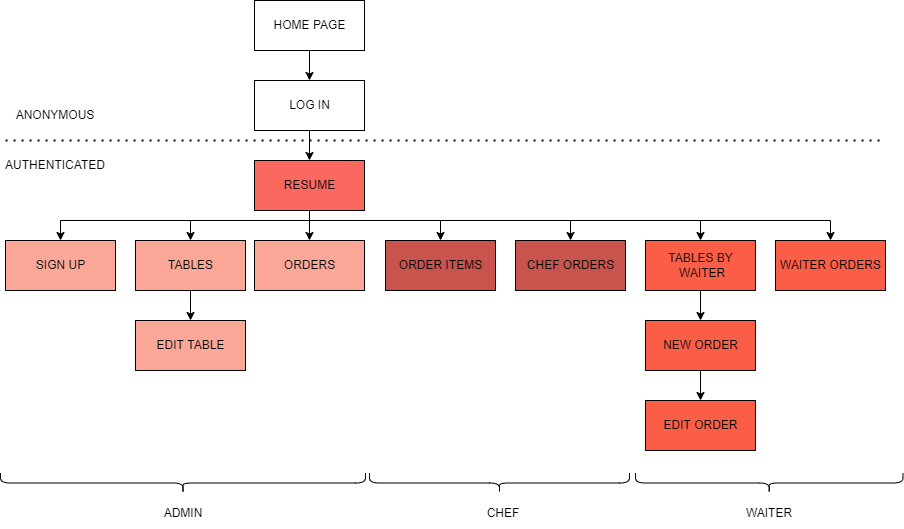
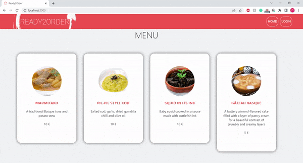
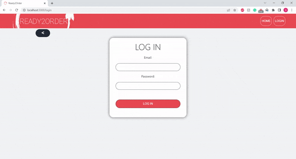
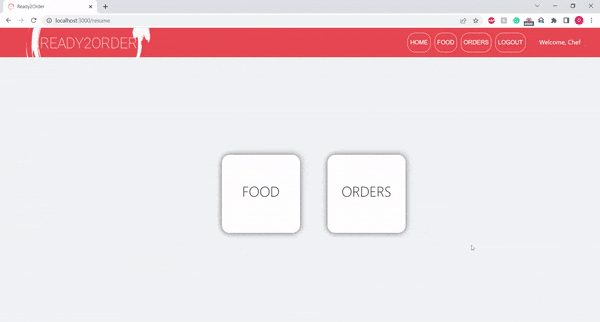
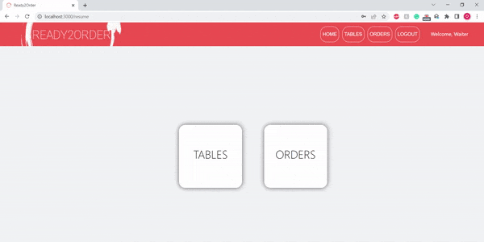

# READY 2 ORDER - Client

## DESCRIPTION OF THE PROJECT

This project consists of a simple restaurant managing system, in which registered employees, eating tables, food orders and order items are held. It works as a menu for the unregistered users (clients) and as a working tool for the employees. 

Registered employees either can be administrators, chefs or waiters. Each of them has different functionalities available. Administrators are responsible for creating both any kind of user and table and editing the last ones. They can also have access to every part of the database. Chefs are responsible for creating new order items, changing their visibility and changing an order's status from ordered to cooked when the order is ready to be served. Waiters are responsible for creating new orders and editing or deleting them, and they can access all their orders and tables.

## TECHNOLOGIES USED

The project has been developed using React (JavaScript + HTML + CSS).

## COMPONENTS AND PAGES STRUCTURE

## DEMO

<b>Anonymous users</b>

  
<b>Registered admins</b>
  

  
<b>Registered chefs</b>
  

  
<b>Registered waiters</b>

## FUTURE WORK

In the future the project could be improved by adding some filtering functionalities, filtering orders by status or filtering order items by type (main, dessert, drink...).

Link to my trello board: https://trello.com/b/MNwKmZfn/final-project

Presentation slides: https://docs.google.com/presentation/d/1f_WBci4Y4_1l_n5YL7tu6_HevMNlDNcMf0zi4EBuMmM/edit?usp=sharing

*A project by Olatz Izagirre.*
